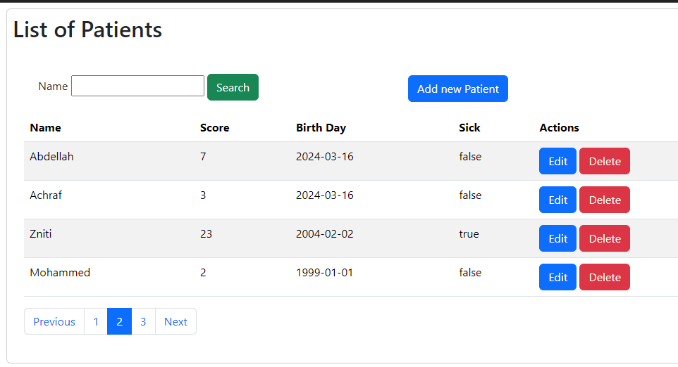

# Spring Data Using Thymeleaf

This repository demonstrates an example of server side rendereing (SSR) using Spring MVC and Thmeleaf.

## Steps Covered:

1. **Data Access Layer with Spring Data:**
    - Implemented the data access layer using Spring Data to interact with the database.
    - Utilized Spring Data repositories and entities to manage database operations.

2. **Creation of Service Layer for Traitement:**
    - Developed a "service" layer to handle business logic and processing.
    - Implemented various services and components to perform specific tasks within the application.

3. **Web Layer with Spring MVC and Thymeleaf:**
    - Created the web layer using Spring MVC for handling HTTP requests and responses.
    - Integrated Thymeleaf as the template engine for server-side HTML rendering.
    - Implemented controllers to manage the flow of data between the client and server.
    - Utilized Thymeleaf's features for dynamic content generation and presentation.

## Screenshots

